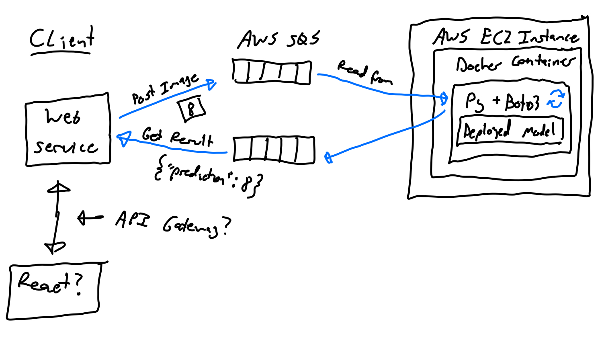

## Documenting an ML Service Deployment

**Purpose**: To practice some of the skills I’ve learned, try out new technologies I haven’t, and see what it takes to deploy a micro-scale “production” ML service. Bare-bones, and may choose to expand on in the future. Not focusing on the modeling / data science workflow as much as the infrastructure and software components.

* **Idea**: Create and deploy an endpoint which receives a picture of a handwritten number (i.e. MNIST dataset) and simply returns the prediction.
* Preliminary design:

* General Thoughts: 
  * This is just a simple endpoint, but using some relevant technologies including containerized deployment with Docker, and FastAPI as a performant API framework
  * Just using Postman as stand in for web client for now
  * May change to using AWS SQS for distributed version of service, and use FastAPI for a separate the web server
* Potential Future Version:

### My Steps So Far:

1. Use jupyter notebook to train/test/save basic NN on MNIST from TensorFlow tutorial (https://www.tensorflow.org/datasets/keras_example)
2. Research FastAPI and scaffold out a simple API
3. Test service locally with Postman
4. Create DockerFile, build Docker image
5. Test containerized service locally with Postman
6. Research unfamiliar AWS resources: VPC, CloudFormation, ECR/ECS, Fargate
7. Configure and deploy to AWS ECS using CloudFormation on default account VPC
   * Referenced guide at https://milapneupane.com.np/2019/07/28/how-to-deploy-a-docker-container-with-aws-ecs-using-cloudformation/
   * Steps include:
     1. Use CloudFormation template to set up ECR stack
     2. Tag and push updated Docker image to ECR
     3. Use CloudFormation template to set up ELB stack (as well as security groups, load balancer listener, etc.)
     4. Use CloudFormation template to set up ECS stack (Use Fargate to manage containers)
     5. Test deployed version with Postman: http://mnist-aws-lb-656408764.us-east-1.elb.amazonaws.com/

* A Better/Updated Diagram of My Current Deployment:

